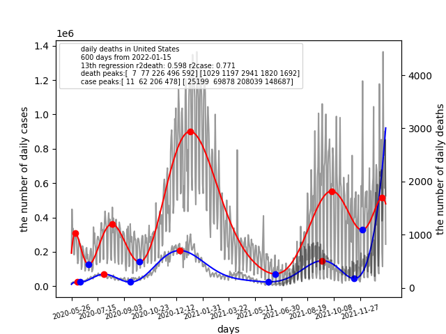

# Exercises for machine learning
You should install Python3.7 or Python3.8 using miniconda before the class.

https://docs.conda.io/en/latest/miniconda.html

# 1. scorecovid
1.0 Read the following papers:

https://doi.org/10.1016/j.health.2021.100005

https://doi.org/10.1007/s12553-021-00597-9

https://doi.org/10.1016/j.jiph.2021.09.010

Interesting recent article on deaths due to COVID-19:

https://www.nature.com/articles/d41586-022-00104-8

1.1 Install scorecovid

$ pip install scorecovid

1.2 Read scorecovid.py:

https://github.com/ytakefuji/score-covid-19-policy/blob/main/scorecovid.py

1.3 Build scorestates.py

scorestates is to score 50 states of the US by dividing the total deaths by the population (millions).

1.4 Build scorejapan.py

scorejapan.py is to score 47 to-do-fu-ken of Japan by diving the total deaths 
by the population (millions).

1.5 Investigate value of a statistical life (VSL) by country in the world.

1.6 Create vsl.csv

VSL stands for the value of a statistical life. vsl.csv is a collection of VSLs of many nations.

1.7 Create covidloss.py

Hint: economic COVID-19 loss can be calculated by multiplying the total deaths 
due to COVID-19 and its VSL. And sort the result with COVID-19 loss.

# 2. daily death prediction due to COVID-19 using the curve-fitting

2.1 Read the following papers:

https://doi.org/10.1159/000514590

Hints: np.polyfit(x,y,z) where x and y are input and output with the zth degree of polinomial.

2.2 Make a program for daily death prediction by entering country name, the number of days, 
and the degree of polinomial for the next seven days.

$ python daily.py 'United States' 200 5

country name='United States', the number of days=200, the degree of polynomial=5

# 3. covidlag

$ covidlag 'United States' 600 13

covilag is a Python program with three parameters including 'United States', 600, and 13.
'United States' is a country name, and 600 and 13 are 600 days from Jan.15 2020 
with 13 degree of curve-fitting polynomial. 

A red line indicates the curve-fitting line on the number of daily deaths. 
A blue line indicates the curve-fitting line on the number of cases. 
Red and blue points show the maxima and minima of the curve-fitting line respectively.

The left vertical axis indicates the number of daily cases while 
the right vertical axis shows the number of daily deaths.

3.1 Create a covidlag.py.

# 4. VAERS
Vaccine Adverse Event Reporting System (VAERS) is a national early warning system to detect possible safety problems in U.S.-licensed vaccines.

View VAERS user guide:

https://vaers.hhs.gov/docs/VAERSDataUseGuide_en_September2021.pdf

Downloadable Datasets on VAERS:

https://vaers.hhs.gov/data/datasets.html

4.0 Download zip file and unzip it.

4.1 Find the number of reports on PFIZER and MODERNA respectively.

4.2 Find the number of deaths on PFIZER and MODERNA respectively.

4.3 Draw the histogram of deaths by age and gender of PFIZER and MODERNA respectively.

4.4 Find the number of deaths and reports on mixing PFIZER and MODERNA respectively

4.5 extra problems will be explained in the class for publishing refereed papers.

# 5. Titanic binary classification

<pre>
pandas, preprocessing, and train_test_split functions are detailed.
all strings must be converted into numbers for machine learning.
</pre>

https://github.com/ytakefuji/titanic

5.1 What is a confusion matrix?

5.2 What should be considered and selected for PCR testing.

Hint: We want to find COVID-19 infected carriers as much as possible. We don't want to miss them.

# 6. Stacking deep learning with ensemble methods

6.1 Stacking deep learning with ensemble methods including RandomForest and ExtraTrees.

Hint:

https://github.com/ytakefuji/concrete/blob/master/concrete_stackNN.py

6.2 Change StackingRegressor library of mlxtend.regressor 
to StackingRegressor of sklearn.ensemble.

6.3 Use SMOTE library for converting imbalanced data to balanced data:

from imblearn.over_sampling import SMOTE

# 7. CDOT regression with data augmentation

Read the following paper:

https://doi.org/10.1016/j.aei.2021.101354

https://github.com/ytakefuji/cdot

7.1 Students should create RandomForestRegressor and ExtraTreesRegressor programs using train.csv and test.csv.

7.2 Then, run the data-augmented programs (cdot_ext.py and cdot_rf.py) using RandomForest and ExtraTrees respectively. After elimnating less feature-importances from date, 
show how the accuracy can be improved.

Observe the different results between augmented and non-augmented programs.

# 8. global warming vs TSI vs CO2 vs temperature

Go to https://github.com/ytakefuji/global-warming

Create a TSI graph and curve-fitting.

Create a global temperature graph and a global CO2 density graph. Build a Python program.

# 9. MediaPipe for gesture recognition
9.1 You should practice in the following sites:

https://github.com/ytakefuji/mediapipe_hand

https://github.com/ytakefuji/mediapipe_face

https://github.com/ytakefuji/airpiano

https://github.com/ytakefuji/mediapipe_pose

https://github.com/ytakefuji/air_calculator

9.2 Use MediaPipe to create exciting new applications for journal publication.

# 10. publish a new PyPI library

You must have your account at PyPI site:

https://pypi.org/account/register/

You should have your account on github.
<pre>
README.md, setup.py, Python program, __main__.py, __init__.py
1. Create a new repository on github
2. Create a README.md on github
3. Create a Python program
4. Modify a setup.py program
5. Create a src directory
6. Move your Python program to src
7. Modify __main__.py and __init__.py under src directory
</pre>
10.1 Read the following repository for publishing a new pypi library.

https://github.com/ytakefuji/pypi_executable_package

10.2 Read the following paper:

https://doi.org/10.3390/ijtm1030019

10.3 Build covidlag.py which can calculate the lag time from infection to death and the 
case fatality rate (CFR) using maxima and minima.

# 11. pseudorandom number

Pseudorandom number plays a key role in AI.

Read the following paper:

Takefuji, Y., Yamada, R. A New Role of Pseudorandom Number as Inductive Inference for Solving Classic Coin-Weighing Puzzles. SN COMPUT. SCI. 1, 162 (2020). 
https://doi.org/10.1007/s42979-020-00167-2

11.1 Organize a successful small team of five members 
with complimetary skills from 1000 members. Build the Python program.

Hint:
https://github.com/ytakefuji/coin-weighing

# 12. New problems

12.1 Use vaccinations-by-manufacturer.csv and the number of deaths by country 
with the population.
Investigate the relationship between vaccines, the population, and the number of deaths. 
What is the most effective method for mitigating and ending the pandemic?

https://raw.githubusercontent.com/owid/covid-19-data/master/public/data/vaccinations/vaccinations-by-manufacturer.csv

12.2 Calculate the impact of Lehman shock and that of COVID-19.

# References
<pre>
1.Y. Takefuji, Analysis of digital fences against COVID-19, Health and Technology, (2021). 
https://doi.org/10.1007/s12553-021-00597-9 Health Technol.(2021) https://doi.org/10.1007/s12553-021-00597-9
2.Y. Takefuji, SCORECOVID: A Python Package Index for scoring the individual policies 
against COVID-19, Healthcare Analytics (2021). 
https://doi.org/10.1016/j.health.2021.100005 Healthcare Analytics (2021)
3.Y. Takefuji, Technological forecasting plays a key role in mitigating the pandemic, 
Journal of Infection and Public Health, 2021, https://doi.org/10.1016/j.jiph.2021.09.010 
4.Y. Takefuji, Correspondence in NEJM, NEJM (2021) 
https://www.nejm.org/doi/full/10.1056/NEJMc21012800.2021.1874227
5.Takefuji Y., Artificial Intelligence suggests that UAE needs to mitigate the small
COVID-19 resurgence, Dubai Med J 10.1159/000514590 Dubai Medical Journal (2021)
6.Takefuji, Y. Python Programming in PyPI for Translational Medicine. 
Int. J. Transl. Med. 2021, 1, 323-331. https://doi.org/10.3390/ijtm1030019
7.Takefuji, Y., Yamada, R. A New Role of Pseudorandom Number as Inductive Inference 
for Solving Classic Coin-Weighing Puzzles. SN COMPUT. SCI. 1, 162 (2020). 
https://doi.org/10.1007/s42979-020-00167-2
8.Takefuji Y., Converting detailed estimates to primary estimates with data augmentation,
Advanced Engineering Informatics, Volume 49, 2021, 101354, ISSN 1474-0346, 
https://doi.org/10.1016/j.aei.2021.101354.
9.	https://pypi.org/project/sshanalysis/
10.	https://pypi.org/project/deathdaily/
11.	https://pypi.org/project/covidlag/
12.	https://pypi.org/project/faceext/
13.	https://pypi.org/project/aircalc/
14.	https://pypi.org/project/airpiano/
15.	https://pypi.org/project/scorecovid/
16.	https://pypi.org/project/bugcount/
</pre>

